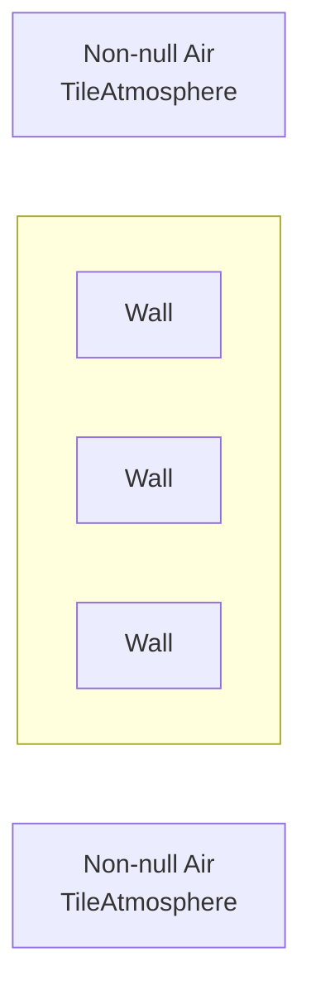
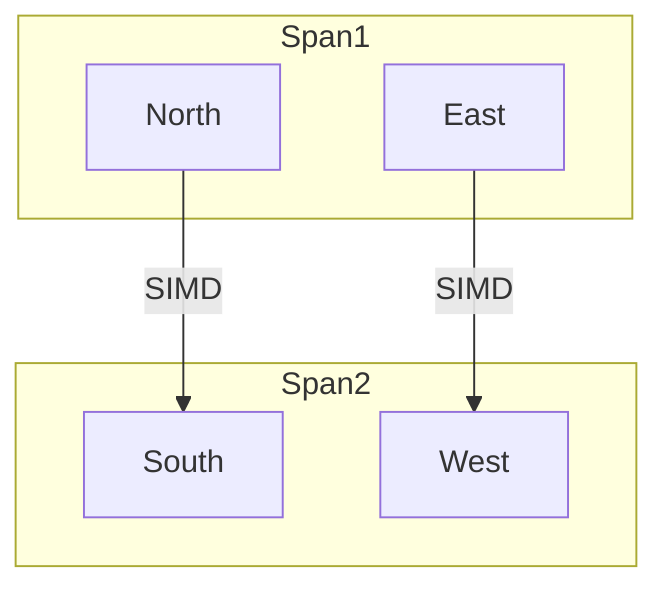
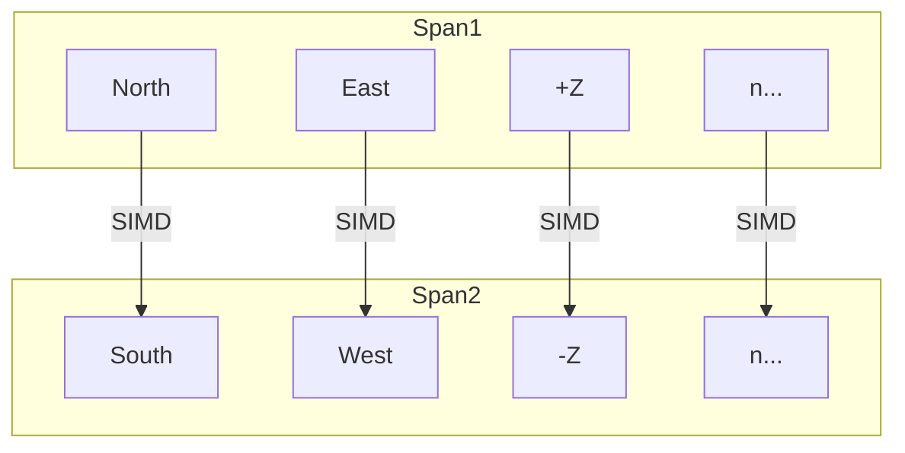

# Delta-Pressure
Delta-Pressure is a relatively new Atmospherics feature that does damage to airtight entities depending on the differences in pressure across the sides of the entity.

## Configuration and Layout
Delta-Pressure has its own processing state `AtmosphereProcessingState.DeltaPressure` and a new partial class `AtmosphereSystem.DeltaPressure` that contains most of the helper methods that are used.
The last crumbs of the system are the pressure damage helper methods located in `DeltaPressureSystem` and the API that handles the addition and removal of entities to the processing list in `AtmosphereSystem.API`.

Delta-Pressure can be entirely disabled via the `atmos.delta_pressure_damage` CVAR.
The parallel solve parameters can also be configured via `atmos.delta_pressure_parallel_process_per_iteration` and `atmos.delta_pressure_parallel_batch_size` respectively.

## Component Life Cycle
### Addition
When a `DeltaPressureComponent` is initialized on an entity, it joins a processing list (`DeltaPressureEntities`) on the `GridAtmosphereComponent` that belongs to the grid that the entity is currently on.
This list is also backed up by a dictionary (`DeltaPressureEntityLookup`) that allows for quick insertions/removals from the list.

### Removal
When we want to remove an entity, we look up its `EntityUid` in the `DeltaPressureEntityLookup` dictionary and get the index that it's currently located it.
We then remove this index from the list and take the entity at the very end of the list and put it in its place.

## System Processing
### Problem Overview
Delta-pressure is quite a simple problem to solve—the annoying part is dealing with performance.

To compute the delta-pressure acting on an entity, we need to check the difference in pressure on opposing sides of it.
In most instances, Delta-Pressure will process an entity that has valid air on two sides, with `null` air on the other two sides:



We explicitly avoid checking diagonals (NE, SE, SW, NW) as air in Atmospherics can only flow in cardinal directions.
This would also double the number of directions we have to check from 4 to 8 (which isn't too big of a deal due to the optimizations in place)

### In-Situ List Processing
Most Atmospherics processing stages involve copying an entire `HashSet` over to a `Queue` and dequeuing an element for processing.
This is undesirable for Delta-Pressure, as the beginning of a processing loop would involve queuing $n$ entities, making our bookkeeping/setup $O(n)$ time.
This is fine for Monstermos or Active Groups, not super desirable if we're processing upwards of 50,000 entities every atmos tick (not to be confused with a game tick).

To solve this, Delta-Pressure entities are kept in a list, with add/remove operations being helped via a dictionary.

That way, we can just iterate over the elements in the list and keep track of where we are using `DeltaPressureCursor`, so we can resume where we left off when we yield processing to the next tick.

### Parallel Solve
Delta-Pressure uses `ParallelRobustJob` in order to speed up the processing of entities.
Workers are assigned a certain span of the list and iterate over each entity in the span.

Note that because we may have to pause and resume processing, we cannot process the list in one go.
As such, if we resume processing, we may resume at `index = 500`.
If we start a parallel job to process the next 500 entities in the list, this may cause the worker to process `index = 250`, which is incorrect, we should be at `index = 750`!
As such, we add the current index reported by the worker `Execute(index)` method to `DeltaPressureCursor` to get our true index to use when processing the list.

If any entity needs to have damage applied, its current pressure delta information is passed into a data struct `DeltaPressureDamageResult` and added to a `ConcurrentQueue` for processing in the main atmospherics thread.

Parallel Solve only runs in parallel when there is a minimum number of entities to process when scheduling the job.
This is determined by $2 \cdot \text{atmos.delta_pressure_parallel_batch_size}$.
So if your `atmos.delta_pressure_parallel_batch_size` was 100, you would need at minimum 200 entities requiring processing for `ParallelRobustJob` to run the job in parallel.

#### Configuration
A certain number of entities are processed per `ProcessDeltaPressure` iteration as defined by the `atmos.delta_pressure_parallel_process_per_iteration` CVAR.
The number of entities processed per job is also configurable by the `atmos.delta_pressure_parallel_batch_size` CVAR.

Note that Atmospherics will check its execution time every $n$ entities processed to see if it is exceeding its time limit for that update tick, and yield if so.
High `atmos.delta_pressure_parallel_process_per_iteration` values may cause Atmospherics will eat up more time than it realizes, and it won't be able to check until a certain number of parallel jobs have been executed.
Low values will cause performance losses due to threading overhead.

The `atmos.delta_pressure_parallel_batch_size` has quirks as well - if too low, processing might suffer from threading overhead, and if too high, the workload may not be distributed as well.
This value has a hardcoded minimum value of `50`.

### Single Instruction, Multiple Data (SIMD)
Delta-Pressure takes advantage of [SIMD](https://en.wikipedia.org/wiki/Single_instruction,_multiple_data) to speed up calculations.
The `NumericsHelpers` class in `RobustToolbox` graciously comes with a lot of vectorized methods that can help us.
Thanks, Vera.

To use them, we need to load our data into spans of opposing pairs, where the north datapoint is compared with the south datapoint, like so:



Spans are created with length $\text{Atmospherics.Directions} \space / \space 2$, as `Atmospherics.Directions` always has directions in pairs.
This means that this will be partially prepped for Multi-Z, or any other higher dimension, if that concerns you:



## Future Performance Improvements
Right now, the time complexity for DeltaPressure is $O(n)$ where $n = \text{number of entities}$.
Parallel solve and SIMD certainly help, but the sheer time is spent processing a lot of entities.

There are two non-vectorized calculations occuring during the main run which take up some time.
The first one is actually retrieving the `GasMixture`'s pressure, as we have to call a `get` method:

```csharp
[ViewVariables]
public float Pressure
{
    get
    {
        if (Volume <= 0) return 0f;
        return TotalMoles * Atmospherics.R * Temperature / Volume;
    }
}
```

This could be vectorized via having a bulk `GasMixture` retrieval helper method that retrieved an array of `GasMixture`s, using methods in `NumericsHelpers` to calculate pressure, as all other values are values that we can simply read.
This is a hypothetical though—a volume of zero might prove to be problematic, however we could `Debug.Assert` that it is not zero as Delta-Pressure is explicitly calculating `GasMixture`s that belong to a `TileAtmosphere`, which will never have a zero volume.

The second calculation is this absolutely naive loop I wrote in 2 seconds:
```csharp
var maxPressure = 0f;
var maxDelta = 0f;
for (var i = 0; i < DeltaPressurePairCount; i++)
{
    maxPressure = MathF.Max(maxPressure, opposingGroupMax[i]);
    maxDelta = MathF.Max(maxDelta, opposingGroupA[i]);
}
```

Replacing this with a vector operation would require me to:
- See if this can even be vectorized (appears to be possible)
- Learn how to code in an unsafe context
- Learn how to use pointers
- Learn how to scalar max using vectors
- Write a lot of tests for it

This loop might also be JIT optimized to begin with.

#### Wider Scope
Any type of major performance improvement has to reduce the number of entities that are actually processed.
This is actually a very similar case to the optimization/refactoring efforts that happened to `AirtightData`—this data is now cached and updated when invalidated by anything that invalidates it, instead of recomputing airtight data for each entity.
This is easier said than done though.

Maintainers are also looking into turning `GasMixture` into a struct which will improve performance, however, that's a long ways off.

### Benchmarking
Delta-Pressure comes with its own `DeltaPressureBenchmark` in `Content.Benchmarks`.
You can use this to test changes that may improve performance.
I wrote this benchmark primarily for trimming down time in hotloops, as well as seeing how much parallel solve saved:

| Method                 | EntityCount | Ticks |      Mean |     Error |    StdDev |
|------------------------|-------------|-------|----------:|----------:|----------:|
| PerformAtmosSimulation | 1           | 30    |  1.357 ms | 0.0174 ms | 0.0163 ms |
| PerformAtmosSimulation | 10          | 30    |  1.396 ms | 0.0155 ms | 0.0137 ms |
| PerformAtmosSimulation | 100         | 30    |  1.383 ms | 0.0080 ms | 0.0074 ms |
| PerformAtmosSimulation | 1000        | 30    |  1.582 ms | 0.0170 ms | 0.0142 ms |
| PerformAtmosSimulation | 5000        | 30    |  2.260 ms | 0.0451 ms | 0.0554 ms |
| PerformAtmosSimulation | 10000       | 30    |  3.143 ms | 0.0621 ms | 0.0828 ms |
| PerformAtmosSimulation | 50000       | 30    | 15.819 ms | 0.3065 ms | 0.3649 ms |

For reference, Bagel Station has ~1300 entities with `DeltaPressureComponent`.

For those that are curious, here was the implementation before parallel solve:

| Method                 | EntityCount | Ticks |      Mean |     Error |    StdDev |
|------------------------|-------------|-------|----------:|----------:|----------:|
| PerformAtmosSimulation | 1           | 30    |  1.372 ms | 0.0112 ms | 0.0099 ms |
| PerformAtmosSimulation | 10          | 30    |  1.328 ms | 0.0127 ms | 0.0119 ms |
| PerformAtmosSimulation | 100         | 30    |  1.383 ms | 0.0233 ms | 0.0218 ms |
| PerformAtmosSimulation | 1000        | 30    |  1.702 ms | 0.0160 ms | 0.0142 ms |
| PerformAtmosSimulation | 5000        | 30    |  3.267 ms | 0.0618 ms | 0.0887 ms |
| PerformAtmosSimulation | 10000       | 30    |  6.026 ms | 0.1195 ms | 0.3291 ms |
| PerformAtmosSimulation | 50000       | 30    | 27.140 ms | 0.5327 ms | 0.5471 ms |

The benchmark will initialize a map of a certain length and lay down a line of windows, representing the most common configuration.
The simulation is then run for 30 ticks, assuring at least 1 atmos tick (as atmos ticks once every 15 ticks right now).