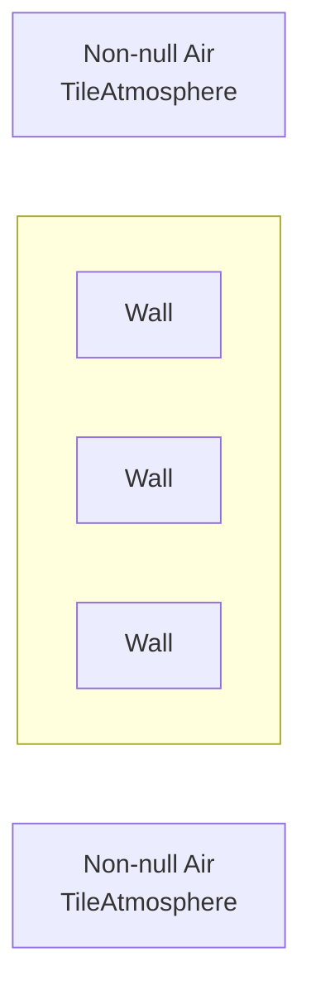
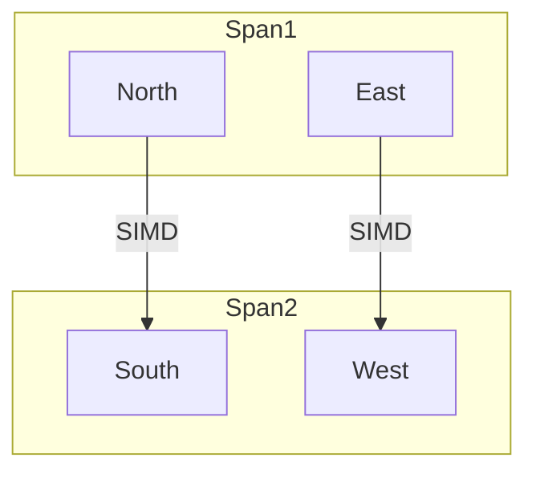
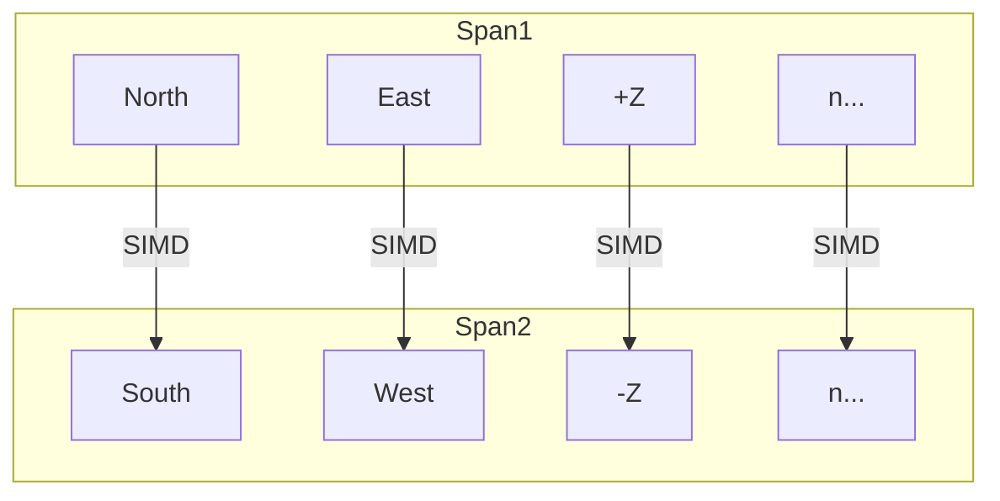

# Delta-Pressure
Delta-Pressure is a relatively new Atmospherics feature that does damage to airtight entities depending on the differences in pressure across the sides of the entity.

## Configuration and Layout
Delta-Pressure has its own processing state `AtmosphereProcessingState.DeltaPressure` and a new partial class `AtmosphereSystem.DeltaPressure` that contains most of the helper methods that are used.
The last crumbs of the system are the pressure damage helper methods located in `DeltaPressureSystem` and the API that handles the addition and removal of entities to the processing list in `AtmosphereSystem.API`.

Delta-Pressure can be entirely disabled via the `atmos.delta_pressure_damage` CVAR.
The parallel solve parameters can also be configured via `atmos.delta_pressure_parallel_process_per_iteration` and `atmos.delta_pressure_parallel_batch_size` respectively.

## Component Life Cycle
### Addition
When a `DeltaPressureComponent` is initialized on an entity, it joins a processing list (`DeltaPressureEntities`) on the `GridAtmosphereComponent` that belongs to the grid that the entity is currently on.
This list is also backed up by a dictionary (`DeltaPressureEntityLookup`) that allows for quick insertions/removals from the list.

### Removal
When we want to remove an entity, we look up its `EntityUid` in the `DeltaPressureEntityLookup` dictionary and get the index that it's currently located it.
We then remove this index from the list and take the entity at the very end of the list and put it in its place.

## System Processing
### Problem Overview
Delta-pressure is quite a simple problem to solve—the annoying part is dealing with performance.

To compute the delta-pressure acting on an entity, we need to check the difference in pressure on opposing sides of it.
In most instances, Delta-Pressure will process an entity that has valid air on two sides, with `null` air on the other two sides:



We explicitly avoid checking diagonals (NE, SE, SW, NW) as air in Atmospherics can only flow in cardinal directions.
This would also double the number of directions we have to check from 4 to 8 (which isn't too big of a deal due to the optimizations in place)

### In-Situ List Processing
Most Atmospherics processing stages involve copying an entire `HashSet` over to a `Queue` and dequeuing an element for processing.
This is undesirable for Delta-Pressure, as the beginning of a processing loop would involve queuing $n$ entities, making our bookkeeping/setup $O(n)$ time.
This is fine for Monstermos or Active Groups, not super desirable if we're processing upwards of 50,000 entities every atmos tick (not to be confused with a game tick).

To solve this, Delta-Pressure entities are kept in a list, with add/remove operations being helped via a dictionary.

That way, we can just iterate over the elements in the list and keep track of where we are using `DeltaPressureCursor`, so we can resume where we left off when we yield processing to the next tick.

### Parallel Solve
Delta-Pressure uses `ParallelRobustJob` in order to speed up the processing of entities.
Workers are assigned a certain span of the list and iterate over each entity in the span.

Note that because we may have to pause and resume processing, we cannot process the list in one go.
As such, if we resume processing, we may resume at `index = 500`.
If we start a parallel job to process the next 500 entities in the list, this may cause the worker to process `index = 250`, which is incorrect, we should be at `index = 750`!
As such, we add the current index reported by the worker `Execute(index)` method to `DeltaPressureCursor` to get our true index to use when processing the list.

If any entity needs to have damage applied, its current pressure delta information is passed into a data struct `DeltaPressureDamageResult` and added to a `ConcurrentQueue` for processing in the main atmospherics thread.

Parallel Solve only runs in parallel when there is a minimum number of entities to process when scheduling the job.
This is determined by $2 \cdot \text{atmos.delta_pressure_parallel_batch_size}$.
So if your `atmos.delta_pressure_parallel_batch_size` was 100, you would need at minimum 200 entities requiring processing for `ParallelRobustJob` to run the job in parallel.

#### Configuration
A certain number of entities are processed per `ProcessDeltaPressure` iteration as defined by the `atmos.delta_pressure_parallel_process_per_iteration` CVAR.
The number of entities processed per job is also configurable by the `atmos.delta_pressure_parallel_batch_size` CVAR.

I've run a benchmark that shows the impact of these values across varying levels of entity count, batch size, and entities per iteration:

<details>
<summary>Chart</summary>


| Method                 | EntityCount | Ticks | BatchSize | EntitiesPerIteration |       Mean |     Error |    StdDev |     Median |
|------------------------|-------------|-------|-----------|----------------------|-----------:|----------:|----------:|-----------:|
| PerformAtmosSimulation | 1           | 30    | 1         | 100                  |   1.378 ms | 0.0239 ms | 0.0212 ms |   1.371 ms |
| PerformAtmosSimulation | 1           | 30    | 1         | 1000                 |   1.393 ms | 0.0196 ms | 0.0184 ms |   1.396 ms |
| PerformAtmosSimulation | 1           | 30    | 1         | 5000                 |   1.377 ms | 0.0236 ms | 0.0209 ms |   1.376 ms |
| PerformAtmosSimulation | 1           | 30    | 1         | 10000                |   1.362 ms | 0.0103 ms | 0.0091 ms |   1.361 ms |
| PerformAtmosSimulation | 1           | 30    | 1         | 50000                |   1.329 ms | 0.0223 ms | 0.0198 ms |   1.324 ms |
| PerformAtmosSimulation | 1           | 30    | 10        | 100                  |   1.329 ms | 0.0087 ms | 0.0082 ms |   1.328 ms |
| PerformAtmosSimulation | 1           | 30    | 10        | 1000                 |   1.338 ms | 0.0174 ms | 0.0162 ms |   1.337 ms |
| PerformAtmosSimulation | 1           | 30    | 10        | 5000                 |   1.350 ms | 0.0099 ms | 0.0093 ms |   1.349 ms |
| PerformAtmosSimulation | 1           | 30    | 10        | 10000                |   1.343 ms | 0.0126 ms | 0.0105 ms |   1.347 ms |
| PerformAtmosSimulation | 1           | 30    | 10        | 50000                |   1.366 ms | 0.0087 ms | 0.0077 ms |   1.365 ms |
| PerformAtmosSimulation | 1           | 30    | 100       | 100                  |   1.359 ms | 0.0168 ms | 0.0157 ms |   1.354 ms |
| PerformAtmosSimulation | 1           | 30    | 100       | 1000                 |   1.324 ms | 0.0137 ms | 0.0129 ms |   1.324 ms |
| PerformAtmosSimulation | 1           | 30    | 100       | 5000                 |   1.354 ms | 0.0116 ms | 0.0103 ms |   1.356 ms |
| PerformAtmosSimulation | 1           | 30    | 100       | 10000                |   1.394 ms | 0.0144 ms | 0.0135 ms |   1.390 ms |
| PerformAtmosSimulation | 1           | 30    | 100       | 50000                |   1.352 ms | 0.0123 ms | 0.0109 ms |   1.351 ms |
| PerformAtmosSimulation | 1           | 30    | 1000      | 100                  |   1.340 ms | 0.0130 ms | 0.0109 ms |   1.341 ms |
| PerformAtmosSimulation | 1           | 30    | 1000      | 1000                 |   1.303 ms | 0.0145 ms | 0.0136 ms |   1.307 ms |
| PerformAtmosSimulation | 1           | 30    | 1000      | 5000                 |   1.349 ms | 0.0162 ms | 0.0143 ms |   1.345 ms |
| PerformAtmosSimulation | 1           | 30    | 1000      | 10000                |   1.357 ms | 0.0150 ms | 0.0141 ms |   1.357 ms |
| PerformAtmosSimulation | 1           | 30    | 1000      | 50000                |   1.316 ms | 0.0117 ms | 0.0110 ms |   1.314 ms |
| PerformAtmosSimulation | 1           | 30    | 5000      | 100                  |   1.345 ms | 0.0122 ms | 0.0114 ms |   1.342 ms |
| PerformAtmosSimulation | 1           | 30    | 5000      | 1000                 |   1.346 ms | 0.0151 ms | 0.0126 ms |   1.344 ms |
| PerformAtmosSimulation | 1           | 30    | 5000      | 5000                 |   1.372 ms | 0.0274 ms | 0.0304 ms |   1.369 ms |
| PerformAtmosSimulation | 1           | 30    | 5000      | 10000                |   1.365 ms | 0.0159 ms | 0.0141 ms |   1.368 ms |
| PerformAtmosSimulation | 1           | 30    | 5000      | 50000                |   1.354 ms | 0.0150 ms | 0.0140 ms |   1.349 ms |
| PerformAtmosSimulation | 1           | 30    | 10000     | 100                  |   1.402 ms | 0.0202 ms | 0.0179 ms |   1.403 ms |
| PerformAtmosSimulation | 1           | 30    | 10000     | 1000                 |   1.391 ms | 0.0189 ms | 0.0177 ms |   1.393 ms |
| PerformAtmosSimulation | 1           | 30    | 10000     | 5000                 |   1.364 ms | 0.0152 ms | 0.0142 ms |   1.359 ms |
| PerformAtmosSimulation | 1           | 30    | 10000     | 10000                |   1.432 ms | 0.0187 ms | 0.0175 ms |   1.432 ms |
| PerformAtmosSimulation | 1           | 30    | 10000     | 50000                |   1.366 ms | 0.0195 ms | 0.0182 ms |   1.361 ms |
| PerformAtmosSimulation | 10          | 30    | 1         | 100                  |   1.407 ms | 0.0242 ms | 0.0226 ms |   1.409 ms |
| PerformAtmosSimulation | 10          | 30    | 1         | 1000                 |   1.400 ms | 0.0225 ms | 0.0210 ms |   1.401 ms |
| PerformAtmosSimulation | 10          | 30    | 1         | 5000                 |   1.453 ms | 0.0171 ms | 0.0160 ms |   1.449 ms |
| PerformAtmosSimulation | 10          | 30    | 1         | 10000                |   1.391 ms | 0.0263 ms | 0.0303 ms |   1.390 ms |
| PerformAtmosSimulation | 10          | 30    | 1         | 50000                |   1.358 ms | 0.0111 ms | 0.0092 ms |   1.360 ms |
| PerformAtmosSimulation | 10          | 30    | 10        | 100                  |   1.319 ms | 0.0092 ms | 0.0086 ms |   1.321 ms |
| PerformAtmosSimulation | 10          | 30    | 10        | 1000                 |   1.389 ms | 0.0072 ms | 0.0064 ms |   1.391 ms |
| PerformAtmosSimulation | 10          | 30    | 10        | 5000                 |   1.359 ms | 0.0151 ms | 0.0142 ms |   1.362 ms |
| PerformAtmosSimulation | 10          | 30    | 10        | 10000                |   1.394 ms | 0.0136 ms | 0.0127 ms |   1.390 ms |
| PerformAtmosSimulation | 10          | 30    | 10        | 50000                |   1.365 ms | 0.0170 ms | 0.0159 ms |   1.358 ms |
| PerformAtmosSimulation | 10          | 30    | 100       | 100                  |   1.415 ms | 0.0255 ms | 0.0226 ms |   1.415 ms |
| PerformAtmosSimulation | 10          | 30    | 100       | 1000                 |   1.414 ms | 0.0191 ms | 0.0179 ms |   1.409 ms |
| PerformAtmosSimulation | 10          | 30    | 100       | 5000                 |   1.346 ms | 0.0211 ms | 0.0208 ms |   1.343 ms |
| PerformAtmosSimulation | 10          | 30    | 100       | 10000                |   1.375 ms | 0.0258 ms | 0.0241 ms |   1.371 ms |
| PerformAtmosSimulation | 10          | 30    | 100       | 50000                |   1.371 ms | 0.0134 ms | 0.0112 ms |   1.373 ms |
| PerformAtmosSimulation | 10          | 30    | 1000      | 100                  |   1.361 ms | 0.0178 ms | 0.0158 ms |   1.358 ms |
| PerformAtmosSimulation | 10          | 30    | 1000      | 1000                 |   1.366 ms | 0.0093 ms | 0.0087 ms |   1.365 ms |
| PerformAtmosSimulation | 10          | 30    | 1000      | 5000                 |   1.352 ms | 0.0175 ms | 0.0164 ms |   1.354 ms |
| PerformAtmosSimulation | 10          | 30    | 1000      | 10000                |   1.338 ms | 0.0110 ms | 0.0097 ms |   1.336 ms |
| PerformAtmosSimulation | 10          | 30    | 1000      | 50000                |   1.372 ms | 0.0130 ms | 0.0121 ms |   1.372 ms |
| PerformAtmosSimulation | 10          | 30    | 5000      | 100                  |   1.350 ms | 0.0243 ms | 0.0227 ms |   1.352 ms |
| PerformAtmosSimulation | 10          | 30    | 5000      | 1000                 |   1.343 ms | 0.0114 ms | 0.0101 ms |   1.340 ms |
| PerformAtmosSimulation | 10          | 30    | 5000      | 5000                 |   1.409 ms | 0.0202 ms | 0.0179 ms |   1.410 ms |
| PerformAtmosSimulation | 10          | 30    | 5000      | 10000                |   1.388 ms | 0.0148 ms | 0.0139 ms |   1.385 ms |
| PerformAtmosSimulation | 10          | 30    | 5000      | 50000                |   1.387 ms | 0.0275 ms | 0.0282 ms |   1.380 ms |
| PerformAtmosSimulation | 10          | 30    | 10000     | 100                  |   1.361 ms | 0.0131 ms | 0.0123 ms |   1.363 ms |
| PerformAtmosSimulation | 10          | 30    | 10000     | 1000                 |   1.386 ms | 0.0169 ms | 0.0158 ms |   1.386 ms |
| PerformAtmosSimulation | 10          | 30    | 10000     | 5000                 |   1.335 ms | 0.0139 ms | 0.0123 ms |   1.336 ms |
| PerformAtmosSimulation | 10          | 30    | 10000     | 10000                |   1.346 ms | 0.0079 ms | 0.0070 ms |   1.347 ms |
| PerformAtmosSimulation | 10          | 30    | 10000     | 50000                |   1.365 ms | 0.0123 ms | 0.0115 ms |   1.362 ms |
| PerformAtmosSimulation | 100         | 30    | 1         | 100                  |   1.492 ms | 0.0248 ms | 0.0232 ms |   1.485 ms |
| PerformAtmosSimulation | 100         | 30    | 1         | 1000                 |   1.445 ms | 0.0287 ms | 0.0363 ms |   1.438 ms |
| PerformAtmosSimulation | 100         | 30    | 1         | 5000                 |   1.467 ms | 0.0091 ms | 0.0076 ms |   1.468 ms |
| PerformAtmosSimulation | 100         | 30    | 1         | 10000                |   1.451 ms | 0.0152 ms | 0.0127 ms |   1.452 ms |
| PerformAtmosSimulation | 100         | 30    | 1         | 50000                |   1.439 ms | 0.0215 ms | 0.0201 ms |   1.439 ms |
| PerformAtmosSimulation | 100         | 30    | 10        | 100                  |   1.400 ms | 0.0183 ms | 0.0162 ms |   1.403 ms |
| PerformAtmosSimulation | 100         | 30    | 10        | 1000                 |   1.440 ms | 0.0173 ms | 0.0154 ms |   1.436 ms |
| PerformAtmosSimulation | 100         | 30    | 10        | 5000                 |   1.458 ms | 0.0218 ms | 0.0204 ms |   1.464 ms |
| PerformAtmosSimulation | 100         | 30    | 10        | 10000                |   1.424 ms | 0.0272 ms | 0.0292 ms |   1.423 ms |
| PerformAtmosSimulation | 100         | 30    | 10        | 50000                |   1.454 ms | 0.0200 ms | 0.0188 ms |   1.456 ms |
| PerformAtmosSimulation | 100         | 30    | 100       | 100                  |   1.437 ms | 0.0206 ms | 0.0193 ms |   1.429 ms |
| PerformAtmosSimulation | 100         | 30    | 100       | 1000                 |   1.356 ms | 0.0159 ms | 0.0133 ms |   1.355 ms |
| PerformAtmosSimulation | 100         | 30    | 100       | 5000                 |   1.378 ms | 0.0175 ms | 0.0155 ms |   1.377 ms |
| PerformAtmosSimulation | 100         | 30    | 100       | 10000                |   1.401 ms | 0.0257 ms | 0.0241 ms |   1.408 ms |
| PerformAtmosSimulation | 100         | 30    | 100       | 50000                |   1.403 ms | 0.0083 ms | 0.0069 ms |   1.403 ms |
| PerformAtmosSimulation | 100         | 30    | 1000      | 100                  |   1.417 ms | 0.0186 ms | 0.0174 ms |   1.417 ms |
| PerformAtmosSimulation | 100         | 30    | 1000      | 1000                 |   1.388 ms | 0.0150 ms | 0.0140 ms |   1.389 ms |
| PerformAtmosSimulation | 100         | 30    | 1000      | 5000                 |   1.397 ms | 0.0138 ms | 0.0123 ms |   1.397 ms |
| PerformAtmosSimulation | 100         | 30    | 1000      | 10000                |   1.381 ms | 0.0108 ms | 0.0096 ms |   1.382 ms |
| PerformAtmosSimulation | 100         | 30    | 1000      | 50000                |   1.409 ms | 0.0209 ms | 0.0185 ms |   1.403 ms |
| PerformAtmosSimulation | 100         | 30    | 5000      | 100                  |   1.402 ms | 0.0142 ms | 0.0132 ms |   1.404 ms |
| PerformAtmosSimulation | 100         | 30    | 5000      | 1000                 |   1.399 ms | 0.0180 ms | 0.0168 ms |   1.395 ms |
| PerformAtmosSimulation | 100         | 30    | 5000      | 5000                 |   1.415 ms | 0.0196 ms | 0.0174 ms |   1.418 ms |
| PerformAtmosSimulation | 100         | 30    | 5000      | 10000                |   1.373 ms | 0.0074 ms | 0.0066 ms |   1.373 ms |
| PerformAtmosSimulation | 100         | 30    | 5000      | 50000                |   1.381 ms | 0.0126 ms | 0.0118 ms |   1.377 ms |
| PerformAtmosSimulation | 100         | 30    | 10000     | 100                  |   1.375 ms | 0.0135 ms | 0.0127 ms |   1.374 ms |
| PerformAtmosSimulation | 100         | 30    | 10000     | 1000                 |   1.385 ms | 0.0204 ms | 0.0190 ms |   1.382 ms |
| PerformAtmosSimulation | 100         | 30    | 10000     | 5000                 |   1.381 ms | 0.0067 ms | 0.0053 ms |   1.380 ms |
| PerformAtmosSimulation | 100         | 30    | 10000     | 10000                |   1.400 ms | 0.0261 ms | 0.0244 ms |   1.398 ms |
| PerformAtmosSimulation | 100         | 30    | 10000     | 50000                |   1.421 ms | 0.0176 ms | 0.0164 ms |   1.417 ms |
| PerformAtmosSimulation | 1000        | 30    | 1         | 100                  |   1.872 ms | 0.0314 ms | 0.0279 ms |   1.869 ms |
| PerformAtmosSimulation | 1000        | 30    | 1         | 1000                 |   1.832 ms | 0.0159 ms | 0.0141 ms |   1.829 ms |
| PerformAtmosSimulation | 1000        | 30    | 1         | 5000                 |   1.812 ms | 0.0253 ms | 0.0211 ms |   1.818 ms |
| PerformAtmosSimulation | 1000        | 30    | 1         | 10000                |   1.836 ms | 0.0144 ms | 0.0135 ms |   1.836 ms |
| PerformAtmosSimulation | 1000        | 30    | 1         | 50000                |   1.856 ms | 0.0173 ms | 0.0162 ms |   1.855 ms |
| PerformAtmosSimulation | 1000        | 30    | 10        | 100                  |   1.656 ms | 0.0236 ms | 0.0221 ms |   1.652 ms |
| PerformAtmosSimulation | 1000        | 30    | 10        | 1000                 |   1.572 ms | 0.0209 ms | 0.0195 ms |   1.578 ms |
| PerformAtmosSimulation | 1000        | 30    | 10        | 5000                 |   1.544 ms | 0.0116 ms | 0.0109 ms |   1.546 ms |
| PerformAtmosSimulation | 1000        | 30    | 10        | 10000                |   1.567 ms | 0.0224 ms | 0.0199 ms |   1.565 ms |
| PerformAtmosSimulation | 1000        | 30    | 10        | 50000                |   1.560 ms | 0.0126 ms | 0.0118 ms |   1.560 ms |
| PerformAtmosSimulation | 1000        | 30    | 100       | 100                  |   1.652 ms | 0.0077 ms | 0.0072 ms |   1.654 ms |
| PerformAtmosSimulation | 1000        | 30    | 100       | 1000                 |   1.503 ms | 0.0137 ms | 0.0121 ms |   1.504 ms |
| PerformAtmosSimulation | 1000        | 30    | 100       | 5000                 |   1.524 ms | 0.0215 ms | 0.0201 ms |   1.525 ms |
| PerformAtmosSimulation | 1000        | 30    | 100       | 10000                |   1.539 ms | 0.0174 ms | 0.0163 ms |   1.538 ms |
| PerformAtmosSimulation | 1000        | 30    | 100       | 50000                |   1.557 ms | 0.0143 ms | 0.0134 ms |   1.559 ms |
| PerformAtmosSimulation | 1000        | 30    | 1000      | 100                  |   1.699 ms | 0.0143 ms | 0.0119 ms |   1.701 ms |
| PerformAtmosSimulation | 1000        | 30    | 1000      | 1000                 |   1.675 ms | 0.0160 ms | 0.0150 ms |   1.669 ms |
| PerformAtmosSimulation | 1000        | 30    | 1000      | 5000                 |   1.674 ms | 0.0101 ms | 0.0094 ms |   1.676 ms |
| PerformAtmosSimulation | 1000        | 30    | 1000      | 10000                |   1.672 ms | 0.0127 ms | 0.0112 ms |   1.675 ms |
| PerformAtmosSimulation | 1000        | 30    | 1000      | 50000                |   1.688 ms | 0.0188 ms | 0.0176 ms |   1.685 ms |
| PerformAtmosSimulation | 1000        | 30    | 5000      | 100                  |   1.687 ms | 0.0153 ms | 0.0143 ms |   1.681 ms |
| PerformAtmosSimulation | 1000        | 30    | 5000      | 1000                 |   1.717 ms | 0.0187 ms | 0.0175 ms |   1.714 ms |
| PerformAtmosSimulation | 1000        | 30    | 5000      | 5000                 |   1.682 ms | 0.0119 ms | 0.0111 ms |   1.683 ms |
| PerformAtmosSimulation | 1000        | 30    | 5000      | 10000                |   1.700 ms | 0.0147 ms | 0.0138 ms |   1.697 ms |
| PerformAtmosSimulation | 1000        | 30    | 5000      | 50000                |   1.688 ms | 0.0169 ms | 0.0158 ms |   1.683 ms |
| PerformAtmosSimulation | 1000        | 30    | 10000     | 100                  |   1.685 ms | 0.0148 ms | 0.0131 ms |   1.687 ms |
| PerformAtmosSimulation | 1000        | 30    | 10000     | 1000                 |   1.661 ms | 0.0142 ms | 0.0133 ms |   1.655 ms |
| PerformAtmosSimulation | 1000        | 30    | 10000     | 5000                 |   1.677 ms | 0.0126 ms | 0.0111 ms |   1.681 ms |
| PerformAtmosSimulation | 1000        | 30    | 10000     | 10000                |   1.671 ms | 0.0102 ms | 0.0095 ms |   1.670 ms |
| PerformAtmosSimulation | 1000        | 30    | 10000     | 50000                |   1.714 ms | 0.0100 ms | 0.0093 ms |   1.716 ms |
| PerformAtmosSimulation | 5000        | 30    | 1         | 100                  |   4.129 ms | 0.0553 ms | 0.0517 ms |   4.131 ms |
| PerformAtmosSimulation | 5000        | 30    | 1         | 1000                 |   3.525 ms | 0.0152 ms | 0.0142 ms |   3.527 ms |
| PerformAtmosSimulation | 5000        | 30    | 1         | 5000                 |   3.387 ms | 0.0106 ms | 0.0099 ms |   3.387 ms |
| PerformAtmosSimulation | 5000        | 30    | 1         | 10000                |   3.764 ms | 0.0245 ms | 0.0217 ms |   3.766 ms |
| PerformAtmosSimulation | 5000        | 30    | 1         | 50000                |   3.470 ms | 0.0468 ms | 0.0391 ms |   3.472 ms |
| PerformAtmosSimulation | 5000        | 30    | 10        | 100                  |   2.805 ms | 0.0554 ms | 0.1156 ms |   2.808 ms |
| PerformAtmosSimulation | 5000        | 30    | 10        | 1000                 |   2.184 ms | 0.0086 ms | 0.0081 ms |   2.182 ms |
| PerformAtmosSimulation | 5000        | 30    | 10        | 5000                 |   2.060 ms | 0.0081 ms | 0.0076 ms |   2.059 ms |
| PerformAtmosSimulation | 5000        | 30    | 10        | 10000                |   2.075 ms | 0.0103 ms | 0.0096 ms |   2.075 ms |
| PerformAtmosSimulation | 5000        | 30    | 10        | 50000                |   2.036 ms | 0.0111 ms | 0.0104 ms |   2.032 ms |
| PerformAtmosSimulation | 5000        | 30    | 100       | 100                  |   2.999 ms | 0.0159 ms | 0.0149 ms |   3.001 ms |
| PerformAtmosSimulation | 5000        | 30    | 100       | 1000                 |   2.152 ms | 0.0279 ms | 0.0247 ms |   2.154 ms |
| PerformAtmosSimulation | 5000        | 30    | 100       | 5000                 |   2.125 ms | 0.0257 ms | 0.0228 ms |   2.123 ms |
| PerformAtmosSimulation | 5000        | 30    | 100       | 10000                |   2.165 ms | 0.0233 ms | 0.0194 ms |   2.162 ms |
| PerformAtmosSimulation | 5000        | 30    | 100       | 50000                |   2.176 ms | 0.0422 ms | 0.0414 ms |   2.168 ms |
| PerformAtmosSimulation | 5000        | 30    | 1000      | 100                  |   3.158 ms | 0.0601 ms | 0.0590 ms |   3.155 ms |
| PerformAtmosSimulation | 5000        | 30    | 1000      | 1000                 |   3.336 ms | 0.0565 ms | 0.0628 ms |   3.330 ms |
| PerformAtmosSimulation | 5000        | 30    | 1000      | 5000                 |   2.048 ms | 0.0397 ms | 0.0371 ms |   2.049 ms |
| PerformAtmosSimulation | 5000        | 30    | 1000      | 10000                |   2.086 ms | 0.0401 ms | 0.0521 ms |   2.086 ms |
| PerformAtmosSimulation | 5000        | 30    | 1000      | 50000                |   2.112 ms | 0.0394 ms | 0.0777 ms |   2.105 ms |
| PerformAtmosSimulation | 5000        | 30    | 5000      | 100                  |   3.389 ms | 0.0662 ms | 0.0788 ms |   3.376 ms |
| PerformAtmosSimulation | 5000        | 30    | 5000      | 1000                 |   3.162 ms | 0.0540 ms | 0.0505 ms |   3.173 ms |
| PerformAtmosSimulation | 5000        | 30    | 5000      | 5000                 |   3.222 ms | 0.0590 ms | 0.1018 ms |   3.205 ms |
| PerformAtmosSimulation | 5000        | 30    | 5000      | 10000                |   3.683 ms | 0.1661 ms | 0.4656 ms |   3.530 ms |
| PerformAtmosSimulation | 5000        | 30    | 5000      | 50000                |   3.759 ms | 0.0748 ms | 0.1836 ms |   3.782 ms |
| PerformAtmosSimulation | 5000        | 30    | 10000     | 100                  |   6.543 ms | 0.1291 ms | 0.2361 ms |   6.579 ms |
| PerformAtmosSimulation | 5000        | 30    | 10000     | 1000                 |   6.769 ms | 0.1467 ms | 0.4326 ms |   6.846 ms |
| PerformAtmosSimulation | 5000        | 30    | 10000     | 5000                 |   6.738 ms | 0.1772 ms | 0.5223 ms |   6.798 ms |
| PerformAtmosSimulation | 5000        | 30    | 10000     | 10000                |   6.733 ms | 0.1486 ms | 0.4357 ms |   6.764 ms |
| PerformAtmosSimulation | 5000        | 30    | 10000     | 50000                |   6.357 ms | 0.4196 ms | 1.2305 ms |   6.720 ms |
| PerformAtmosSimulation | 10000       | 30    | 1         | 100                  |   7.452 ms | 0.1489 ms | 0.1773 ms |   7.444 ms |
| PerformAtmosSimulation | 10000       | 30    | 1         | 1000                 |   6.564 ms | 0.0275 ms | 0.0257 ms |   6.565 ms |
| PerformAtmosSimulation | 10000       | 30    | 1         | 5000                 |   5.803 ms | 0.0587 ms | 0.0490 ms |   5.803 ms |
| PerformAtmosSimulation | 10000       | 30    | 1         | 10000                |   5.393 ms | 0.0208 ms | 0.0162 ms |   5.397 ms |
| PerformAtmosSimulation | 10000       | 30    | 1         | 50000                |   6.157 ms | 0.0382 ms | 0.0357 ms |   6.157 ms |
| PerformAtmosSimulation | 10000       | 30    | 10        | 100                  |   6.695 ms | 0.1209 ms | 0.1131 ms |   6.731 ms |
| PerformAtmosSimulation | 10000       | 30    | 10        | 1000                 |   3.997 ms | 0.0775 ms | 0.0796 ms |   4.004 ms |
| PerformAtmosSimulation | 10000       | 30    | 10        | 5000                 |   3.492 ms | 0.0683 ms | 0.0935 ms |   3.493 ms |
| PerformAtmosSimulation | 10000       | 30    | 10        | 10000                |   3.386 ms | 0.0663 ms | 0.0790 ms |   3.380 ms |
| PerformAtmosSimulation | 10000       | 30    | 10        | 50000                |   3.428 ms | 0.0475 ms | 0.0444 ms |   3.423 ms |
| PerformAtmosSimulation | 10000       | 30    | 100       | 100                  |  12.852 ms | 0.2568 ms | 0.3765 ms |  12.932 ms |
| PerformAtmosSimulation | 10000       | 30    | 100       | 1000                 |   4.666 ms | 0.0905 ms | 0.1209 ms |   4.688 ms |
| PerformAtmosSimulation | 10000       | 30    | 100       | 5000                 |   3.540 ms | 0.0691 ms | 0.0946 ms |   3.557 ms |
| PerformAtmosSimulation | 10000       | 30    | 100       | 10000                |   3.365 ms | 0.0639 ms | 0.0598 ms |   3.348 ms |
| PerformAtmosSimulation | 10000       | 30    | 100       | 50000                |   2.552 ms | 0.0488 ms | 0.0561 ms |   2.557 ms |
| PerformAtmosSimulation | 10000       | 30    | 1000      | 100                  |   5.224 ms | 0.0997 ms | 0.1261 ms |   5.228 ms |
| PerformAtmosSimulation | 10000       | 30    | 1000      | 1000                 |   6.133 ms | 0.1343 ms | 0.3722 ms |   6.146 ms |
| PerformAtmosSimulation | 10000       | 30    | 1000      | 5000                 |   2.486 ms | 0.0435 ms | 0.0651 ms |   2.488 ms |
| PerformAtmosSimulation | 10000       | 30    | 1000      | 10000                |   2.756 ms | 0.0527 ms | 0.0493 ms |   2.762 ms |
| PerformAtmosSimulation | 10000       | 30    | 1000      | 50000                |   2.729 ms | 0.0442 ms | 0.0414 ms |   2.738 ms |
| PerformAtmosSimulation | 10000       | 30    | 5000      | 100                  |   5.298 ms | 0.1052 ms | 0.1439 ms |   5.308 ms |
| PerformAtmosSimulation | 10000       | 30    | 5000      | 1000                 |   6.876 ms | 0.2931 ms | 0.8411 ms |   6.602 ms |
| PerformAtmosSimulation | 10000       | 30    | 5000      | 5000                 |   5.958 ms | 0.1184 ms | 0.3035 ms |   5.988 ms |
| PerformAtmosSimulation | 10000       | 30    | 5000      | 10000                |   7.268 ms | 0.1449 ms | 0.1355 ms |   7.269 ms |
| PerformAtmosSimulation | 10000       | 30    | 5000      | 50000                |   5.442 ms | 0.1074 ms | 0.1936 ms |   5.488 ms |
| PerformAtmosSimulation | 10000       | 30    | 10000     | 100                  |   5.835 ms | 0.1083 ms | 0.1013 ms |   5.821 ms |
| PerformAtmosSimulation | 10000       | 30    | 10000     | 1000                 |   6.615 ms | 0.1323 ms | 0.2790 ms |   6.710 ms |
| PerformAtmosSimulation | 10000       | 30    | 10000     | 5000                 |   5.274 ms | 0.0935 ms | 0.1400 ms |   5.282 ms |
| PerformAtmosSimulation | 10000       | 30    | 10000     | 10000                |   5.589 ms | 0.1100 ms | 0.2437 ms |   5.646 ms |
| PerformAtmosSimulation | 10000       | 30    | 10000     | 50000                |   5.889 ms | 0.1160 ms | 0.2547 ms |   5.936 ms |
| PerformAtmosSimulation | 50000       | 30    | 1         | 100                  |  20.386 ms | 0.1687 ms | 0.1578 ms |  20.378 ms |
| PerformAtmosSimulation | 50000       | 30    | 1         | 1000                 |  21.009 ms | 0.1109 ms | 0.1037 ms |  20.970 ms |
| PerformAtmosSimulation | 50000       | 30    | 1         | 5000                 |  23.111 ms | 0.2450 ms | 0.2292 ms |  23.026 ms |
| PerformAtmosSimulation | 50000       | 30    | 1         | 10000                |  22.921 ms | 0.2011 ms | 0.1881 ms |  22.847 ms |
| PerformAtmosSimulation | 50000       | 30    | 1         | 50000                |  18.446 ms | 0.1978 ms | 0.1754 ms |  18.411 ms |
| PerformAtmosSimulation | 50000       | 30    | 10        | 100                  |  14.799 ms | 0.0625 ms | 0.0585 ms |  14.779 ms |
| PerformAtmosSimulation | 50000       | 30    | 10        | 1000                 |   9.373 ms | 0.0859 ms | 0.0761 ms |   9.349 ms |
| PerformAtmosSimulation | 50000       | 30    | 10        | 5000                 |   7.612 ms | 0.0703 ms | 0.0624 ms |   7.619 ms |
| PerformAtmosSimulation | 50000       | 30    | 10        | 10000                |   7.284 ms | 0.0654 ms | 0.0612 ms |   7.299 ms |
| PerformAtmosSimulation | 50000       | 30    | 10        | 50000                |   7.067 ms | 0.0519 ms | 0.0485 ms |   7.073 ms |
| PerformAtmosSimulation | 50000       | 30    | 100       | 100                  |  29.021 ms | 0.3156 ms | 0.2952 ms |  29.060 ms |
| PerformAtmosSimulation | 50000       | 30    | 100       | 1000                 |   9.966 ms | 0.1060 ms | 0.0940 ms |   9.968 ms |
| PerformAtmosSimulation | 50000       | 30    | 100       | 5000                 |   9.016 ms | 0.1776 ms | 0.1661 ms |   9.031 ms |
| PerformAtmosSimulation | 50000       | 30    | 100       | 10000                |   7.974 ms | 0.1044 ms | 0.0926 ms |   7.963 ms |
| PerformAtmosSimulation | 50000       | 30    | 100       | 50000                |   6.605 ms | 0.0425 ms | 0.0377 ms |   6.597 ms |
| PerformAtmosSimulation | 50000       | 30    | 1000      | 100                  |  28.830 ms | 0.2649 ms | 0.2478 ms |  28.824 ms |
| PerformAtmosSimulation | 50000       | 30    | 1000      | 1000                 |  49.013 ms | 0.9722 ms | 1.9416 ms |  49.063 ms |
| PerformAtmosSimulation | 50000       | 30    | 1000      | 5000                 |  13.112 ms | 0.2164 ms | 0.1918 ms |  13.169 ms |
| PerformAtmosSimulation | 50000       | 30    | 1000      | 10000                |   9.846 ms | 0.0999 ms | 0.0885 ms |   9.845 ms |
| PerformAtmosSimulation | 50000       | 30    | 1000      | 50000                |   6.766 ms | 0.0494 ms | 0.0412 ms |   6.766 ms |
| PerformAtmosSimulation | 50000       | 30    | 5000      | 100                  |  28.360 ms | 0.5384 ms | 0.5036 ms |  28.395 ms |
| PerformAtmosSimulation | 50000       | 30    | 5000      | 1000                 |  47.601 ms | 0.9228 ms | 0.9063 ms |  47.724 ms |
| PerformAtmosSimulation | 50000       | 30    | 5000      | 5000                 |  52.719 ms | 1.0302 ms | 1.5419 ms |  53.189 ms |
| PerformAtmosSimulation | 50000       | 30    | 5000      | 10000                |  53.703 ms | 1.0456 ms | 1.7470 ms |  54.395 ms |
| PerformAtmosSimulation | 50000       | 30    | 5000      | 50000                |   9.668 ms | 0.0724 ms | 0.0677 ms |   9.648 ms |
| PerformAtmosSimulation | 50000       | 30    | 10000     | 100                  |  28.713 ms | 0.4082 ms | 0.3618 ms |  28.638 ms |
| PerformAtmosSimulation | 50000       | 30    | 10000     | 1000                 |  47.823 ms | 0.9302 ms | 1.5541 ms |  48.032 ms |
| PerformAtmosSimulation | 50000       | 30    | 10000     | 5000                 |  51.748 ms | 1.0341 ms | 1.6100 ms |  51.286 ms |
| PerformAtmosSimulation | 50000       | 30    | 10000     | 10000                |  53.782 ms | 1.0547 ms | 1.6420 ms |  54.305 ms |
| PerformAtmosSimulation | 50000       | 30    | 10000     | 50000                |  13.122 ms | 0.2573 ms | 0.2753 ms |  13.130 ms |
| PerformAtmosSimulation | 100000      | 30    | 1         | 100                  |  30.030 ms | 0.1263 ms | 0.1182 ms |  30.017 ms |
| PerformAtmosSimulation | 100000      | 30    | 1         | 1000                 |  32.940 ms | 0.4946 ms | 0.4627 ms |  32.979 ms |
| PerformAtmosSimulation | 100000      | 30    | 1         | 5000                 |  44.337 ms | 0.3222 ms | 0.2690 ms |  44.363 ms |
| PerformAtmosSimulation | 100000      | 30    | 1         | 10000                |  34.367 ms | 0.1438 ms | 0.1275 ms |  34.378 ms |
| PerformAtmosSimulation | 100000      | 30    | 1         | 50000                |  32.909 ms | 0.6192 ms | 0.5792 ms |  33.138 ms |
| PerformAtmosSimulation | 100000      | 30    | 10        | 100                  |  23.842 ms | 0.2284 ms | 0.1907 ms |  23.877 ms |
| PerformAtmosSimulation | 100000      | 30    | 10        | 1000                 |  15.507 ms | 0.1585 ms | 0.1483 ms |  15.487 ms |
| PerformAtmosSimulation | 100000      | 30    | 10        | 5000                 |  14.368 ms | 0.1450 ms | 0.1285 ms |  14.400 ms |
| PerformAtmosSimulation | 100000      | 30    | 10        | 10000                |  13.987 ms | 0.1512 ms | 0.1414 ms |  13.923 ms |
| PerformAtmosSimulation | 100000      | 30    | 10        | 50000                |  13.336 ms | 0.1567 ms | 0.1466 ms |  13.394 ms |
| PerformAtmosSimulation | 100000      | 30    | 100       | 100                  |  42.620 ms | 1.0408 ms | 3.0687 ms |  42.933 ms |
| PerformAtmosSimulation | 100000      | 30    | 100       | 1000                 |  16.439 ms | 0.1661 ms | 0.1554 ms |  16.413 ms |
| PerformAtmosSimulation | 100000      | 30    | 100       | 5000                 |  17.399 ms | 0.3471 ms | 0.3565 ms |  17.457 ms |
| PerformAtmosSimulation | 100000      | 30    | 100       | 10000                |  15.072 ms | 0.1457 ms | 0.1362 ms |  15.119 ms |
| PerformAtmosSimulation | 100000      | 30    | 100       | 50000                |  12.774 ms | 0.1018 ms | 0.0952 ms |  12.786 ms |
| PerformAtmosSimulation | 100000      | 30    | 1000      | 100                  |  42.476 ms | 0.8236 ms | 0.8089 ms |  42.374 ms |
| PerformAtmosSimulation | 100000      | 30    | 1000      | 1000                 |  85.229 ms | 0.9500 ms | 0.8422 ms |  85.023 ms |
| PerformAtmosSimulation | 100000      | 30    | 1000      | 5000                 |  28.060 ms | 0.5162 ms | 0.4829 ms |  28.243 ms |
| PerformAtmosSimulation | 100000      | 30    | 1000      | 10000                |  19.156 ms | 0.2167 ms | 0.2027 ms |  19.186 ms |
| PerformAtmosSimulation | 100000      | 30    | 1000      | 50000                |  13.060 ms | 0.0712 ms | 0.0631 ms |  13.052 ms |
| PerformAtmosSimulation | 100000      | 30    | 5000      | 100                  |  41.016 ms | 0.6795 ms | 0.6023 ms |  40.880 ms |
| PerformAtmosSimulation | 100000      | 30    | 5000      | 1000                 |  90.120 ms | 1.9823 ms | 5.8449 ms |  90.313 ms |
| PerformAtmosSimulation | 100000      | 30    | 5000      | 5000                 | 113.633 ms | 2.2685 ms | 6.0159 ms | 110.706 ms |
| PerformAtmosSimulation | 100000      | 30    | 5000      | 10000                | 111.276 ms | 2.2240 ms | 6.4874 ms | 108.064 ms |
| PerformAtmosSimulation | 100000      | 30    | 5000      | 50000                |  18.850 ms | 0.3150 ms | 0.2792 ms |  18.856 ms |
| PerformAtmosSimulation | 100000      | 30    | 10000     | 100                  |  42.369 ms | 0.8247 ms | 0.9498 ms |  42.467 ms |
| PerformAtmosSimulation | 100000      | 30    | 10000     | 1000                 |  85.774 ms | 1.8845 ms | 5.5566 ms |  84.206 ms |
| PerformAtmosSimulation | 100000      | 30    | 10000     | 5000                 | 114.850 ms | 2.2871 ms | 6.4880 ms | 111.771 ms |
| PerformAtmosSimulation | 100000      | 30    | 10000     | 10000                | 111.079 ms | 2.2344 ms | 6.4825 ms | 107.760 ms |
| PerformAtmosSimulation | 100000      | 30    | 10000     | 50000                |  27.086 ms | 0.4421 ms | 0.3692 ms |  27.078 ms |


</details>

Note that Atmospherics will check its execution time every $n$ entities processed to see if it is exceeding its time limit for that update tick, and yield if so.
High `atmos.delta_pressure_parallel_process_per_iteration` values may cause Atmospherics will eat up more time than it realizes, and it won't be able to check until a certain number of parallel jobs have been executed.
Low values will cause performance losses due to threading overhead.

The `atmos.delta_pressure_parallel_batch_size` has quirks as well - if too low, processing might suffer from threading overhead, and if too high, the workload may not be distributed as well.
This value has a hardcoded minimum value of `50`.

### Single Instruction, Multiple Data (SIMD)
Delta-Pressure takes advantage of [SIMD](https://en.wikipedia.org/wiki/Single_instruction,_multiple_data) to speed up calculations.
The `NumericsHelpers` class in `RobustToolbox` graciously comes with a lot of vectorized methods that can help us.
Thanks, Vera.

To use them, we need to load our data into spans of opposing pairs, where the north datapoint is compared with the south datapoint, like so:



Spans are created with length $\text{Atmospherics.Directions} \space / \space 2$, as `Atmospherics.Directions` always has directions in pairs.
This means that this will be partially prepped for Multi-Z, or any other higher dimension, if that concerns you:



## Future Performance Improvements
Right now, the time complexity for DeltaPressure is $O(n)$ where $n = \text{number of entities}$.
Parallel solve and SIMD certainly help, but the sheer time is spent processing a lot of entities.

There are two non-vectorized calculations occuring during the main run which take up some time.
The first one is actually retrieving the `GasMixture`'s pressure, as we have to call a `get` method:

```csharp
[ViewVariables]
public float Pressure
{
    get
    {
        if (Volume <= 0) return 0f;
        return TotalMoles * Atmospherics.R * Temperature / Volume;
    }
}
```

This could be vectorized via having a bulk `GasMixture` retrieval helper method that retrieved an array of `GasMixture`s, using methods in `NumericsHelpers` to calculate pressure, as all other values are values that we can simply read.
This is a hypothetical though—a volume of zero might prove to be problematic, however we could `Debug.Assert` that it is not zero as Delta-Pressure is explicitly calculating `GasMixture`s that belong to a `TileAtmosphere`, which will never have a zero volume.

The second calculation is this absolutely naive loop I wrote in 2 seconds:
```csharp
var maxPressure = 0f;
var maxDelta = 0f;
for (var i = 0; i < DeltaPressurePairCount; i++)
{
    maxPressure = MathF.Max(maxPressure, opposingGroupMax[i]);
    maxDelta = MathF.Max(maxDelta, opposingGroupA[i]);
}
```

Replacing this with a vector operation would require me to:
- See if this can even be vectorized (appears to be possible)
- Learn how to code in an unsafe context
- Learn how to use pointers
- Learn how to scalar max using vectors
- Write a lot of tests for it

This loop might also be JIT optimized to begin with.

#### Wider Scope
Any type of major performance improvement has to reduce the number of entities that are actually processed.
This is actually a very similar case to the optimization/refactoring efforts that happened to `AirtightData`—this data is now cached and updated when invalidated by anything that invalidates it, instead of recomputing airtight data for each entity.
This is easier said than done though.

Maintainers are also looking into turning `GasMixture` into a struct which will improve performance, however, that's a long ways off.

### Benchmarking
Delta-Pressure comes with its own `DeltaPressureBenchmark` in `Content.Benchmarks`.
You can use this to test changes that may improve performance.
I wrote this benchmark primarily for trimming down time in hotloops, as well as seeing how much parallel solve saved:

| Method                 | EntityCount | Ticks |      Mean |     Error |    StdDev |
|------------------------|-------------|-------|----------:|----------:|----------:|
| PerformAtmosSimulation | 1           | 30    |  1.357 ms | 0.0174 ms | 0.0163 ms |
| PerformAtmosSimulation | 10          | 30    |  1.396 ms | 0.0155 ms | 0.0137 ms |
| PerformAtmosSimulation | 100         | 30    |  1.383 ms | 0.0080 ms | 0.0074 ms |
| PerformAtmosSimulation | 1000        | 30    |  1.582 ms | 0.0170 ms | 0.0142 ms |
| PerformAtmosSimulation | 5000        | 30    |  2.260 ms | 0.0451 ms | 0.0554 ms |
| PerformAtmosSimulation | 10000       | 30    |  3.143 ms | 0.0621 ms | 0.0828 ms |
| PerformAtmosSimulation | 50000       | 30    | 15.819 ms | 0.3065 ms | 0.3649 ms |

For reference, Bagel Station has ~1300 entities with `DeltaPressureComponent`.

For those that are curious, here was the implementation before parallel solve:

| Method                 | EntityCount | Ticks |      Mean |     Error |    StdDev |
|------------------------|-------------|-------|----------:|----------:|----------:|
| PerformAtmosSimulation | 1           | 30    |  1.372 ms | 0.0112 ms | 0.0099 ms |
| PerformAtmosSimulation | 10          | 30    |  1.328 ms | 0.0127 ms | 0.0119 ms |
| PerformAtmosSimulation | 100         | 30    |  1.383 ms | 0.0233 ms | 0.0218 ms |
| PerformAtmosSimulation | 1000        | 30    |  1.702 ms | 0.0160 ms | 0.0142 ms |
| PerformAtmosSimulation | 5000        | 30    |  3.267 ms | 0.0618 ms | 0.0887 ms |
| PerformAtmosSimulation | 10000       | 30    |  6.026 ms | 0.1195 ms | 0.3291 ms |
| PerformAtmosSimulation | 50000       | 30    | 27.140 ms | 0.5327 ms | 0.5471 ms |

The benchmark will initialize a map of a certain length and lay down a line of windows, representing the most common configuration.
The simulation is then run for 30 ticks, assuring at least 1 atmos tick (as atmos ticks once every 15 ticks right now).